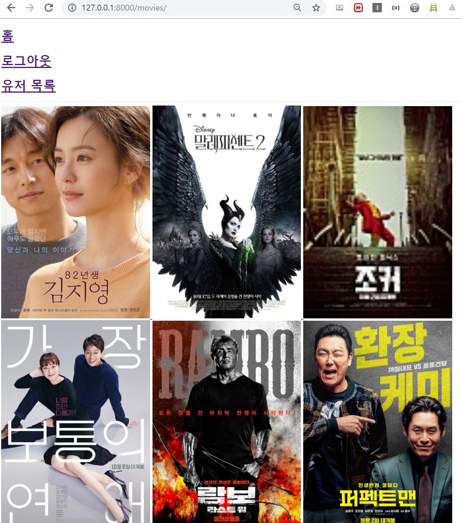
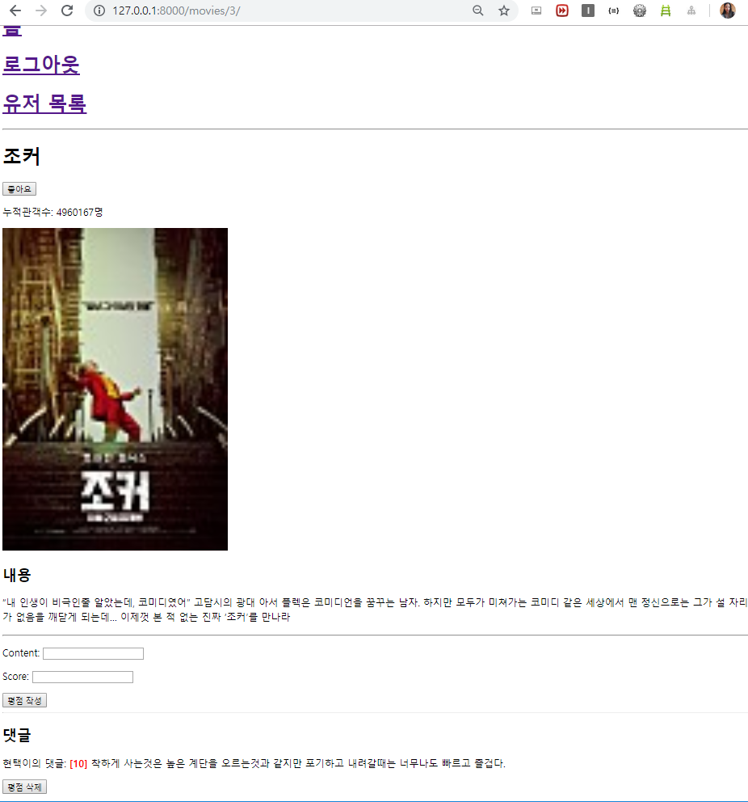
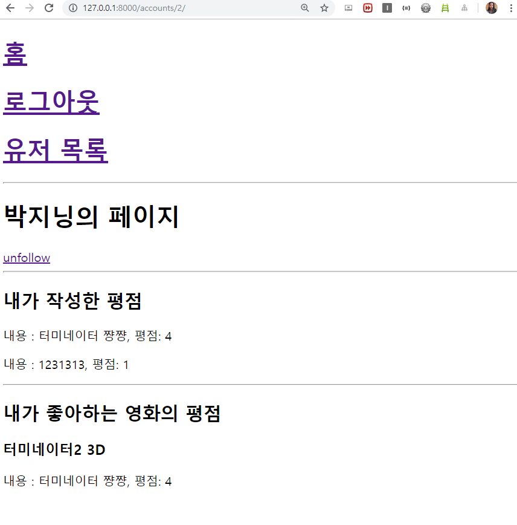

# 07 - 데이터베이스 설계

## 1. 목표

* 협업을 통한 데이터베이스 모델링 및 기능 구현
* 다양한 형태의 데이터베이스 관계 설정

## 2. 준비 사항

1. **(필수)** Python Web Framework
   * Django 2.2.x
   * Python 3.7.x
2. (선택) 샘플 영화 정보

## 3. 요구 사항

1. **데이터베이스 설계**

* `db.sqlite3`에서 테이블 간의 관계는 아래와 같습니다.

  * `accounts_users`

    | **필드명** | **자료형** | **설명**    |
    | ---------- | ---------- | ----------- |
    | id         | Integer    | Primary Key |
    | username   | String     | 필수        |
    | password   | String     | 필수        |
    | email      | String     | 선택        |
    | first_name | String     | 선택        |
    | last_name  | String     | 선택        |

  * `movies_movies`

    | **필드명**  | **자료형** | **설명**                   |
    | ----------- | ---------- | -------------------------- |
    | id          | Integer    | Primary Key                |
    | title       | String     | 영화명                     |
    | audience    | Integer    | 누적 관객수                |
    | poster_url  | String     | 포스터 이미지 URL          |
    | description | Text       | 영화 소개                  |
    | genre_id    | Integer    | Genre의 Primary Key(id 값) |

  * `movies_genres`

    | **필드명** | **자료형** | **설명**    |
    | ---------- | ---------- | ----------- |
    | id         | Integer    | Primary Key |
    | name       | String     | 장르 구분   |

  * `movies_reviews`

    | **필드명** | **자료형** | **설명**                   |
    | ---------- | ---------- | -------------------------- |
    | id         | Integer    | Primary Key                |
    | content    | String     | 한줄평(평가 내용)          |
    | score      | Integer    | 평점                       |
    | movie_id   | Integer    | Movie의 Primary Key(id 값) |
    | user_id    | Integer    | User의 Primary Key(id 값)  |
    
  * `movies_like_movies_user`
  
    | **필드명** | **자료형** | **설명**                  |
    | ---------- | ---------- | ------------------------- |
    | id         | Integer    | Primary Key               |
    | user_id    | Integer    | User의 Primary Key(id 값) |
    | movie_id   | Integer    | Movie의 Primary Key(id 값)|
    
  * `accounts/models.py`
  
    ```python
    from django.db import models
    from django.contrib.auth.models import AbstractUser
    from django.conf import settings
    # Create your models here.
    class User(AbstractUser):
        followers = models.ManyToManyField(
            settings.AUTH_USER_MODEL,
            related_name='followings',
            blank=True
            )
    ```
  
    * `settings.py`에 `AUTH_USER_MODEL = 'accounts.User'` 추가
  
  * `movies/models.py`
  
    ```python
    from django.db import models
    from django.conf import settings
    # Create your models here.
    
    class Genre(models.Model):
        name = models.CharField(max_length=30)
    
    class Movie(models.Model):
        title = models.CharField(max_length=40)
        audience = models.IntegerField()
        poster_url = models.CharField(max_length=100)
        description =  models.TextField()
        genre = models.ForeignKey(Genre, on_delete=models.CASCADE)
        like_users = models.ManyToManyField(
            settings.AUTH_USER_MODEL,
            related_name='like_movies',
            blank=True
            )
    
    class Review(models.Model):
        content = models.CharField(max_length=100)
        score = models.IntegerField()
        movie = models.ForeignKey(Movie, on_delete=models.CASCADE)
        user = models.ForeignKey(settings.AUTH_USER_MODEL, on_delete=models.CASCADE)
    ```
  
    

2. **Seed Data 반영**

   1. 주어진 `movie.json` 과 `genre.json` 을 `movies/fixtures/` 디렉토리로 옮깁니다.
   2. 아래의 명령어를 통해 반영합니다.

   ``` shell
   $ python manage.py loaddata genre.json
   Installed 11 object(s) from 1 fixture(s)
   $ python manage.py loaddata movie.json
   Installed 10 object(s) from 1 fixture(s)
   ```

   3. `admin.py` 에 `Genre` 와 `Movie` 클래스를 등록한 후, `/admin` 을 통해 실제로 데이터베이스에 반영되었는지 확인해봅시다.

3. **`accounts` App**

   * 유저 회원가입과 로그인, 로그아웃 기능을 구현해야 합니다.
     1. 유저 목록 ( `/accounts/` )
        1. **(필수)** 사용자의 목록이 나타나며, 사용자의 `username` 을 클릭하면 `유저 상세보기` 페이지로 넘어갑니다.
     2. 유저 상세보기 ( `/accounts/{user_pk}/` )
        1. **(필수)** 로그인한 사람만이 사용자의 상세 내용 페이지에서 해당 유저를 follow하거나 unfollow를 할 수 있습니다.
        2. **(필수)** 해당 유저가 작성한 평점 정보가 모두 출력됩니다.
        3. **(필수)** 해당 유저가 좋아하는 평점 정보가 모두 출력됩니다.
        4. (선택) 각각 평점을 수정할 수 있도록 구성합니다.

   * `accounts/views.py`

     ```python
     from django.shortcuts import render, redirect, get_object_or_404
     from .models import User
     from .forms import CustomerUserCreationForm
     from django.contrib.auth import login as auth_login
     from django.contrib.auth import logout as auth_logout
     from django.contrib.auth.forms import AuthenticationForm
     from django.contrib.auth import get_user_model
     
     # Create your views here.
     def index(request):
         users = User.objects.all()
         context = {
             'users': users
         }
         return render(request, 'accounts/index.html', context)
     
     def detail(request, user_pk):
         user = User.objects.get(pk=user_pk)
         context = {
             'user_profile': user
         }
         return render(request, 'accounts/detail.html', context)
     
     def signup(request):
         if request.method == 'POST':
             form = CustomerUserCreationForm(request.POST)
             if form.is_valid():
                 form.save()
                 return redirect('movies:index')
         else:
             form = CustomerUserCreationForm()
         context = {
             'form': form
         }
         return render(request, 'accounts/signup.html', context)
     
     def login(request):
         if request.method == 'POST':
             form = AuthenticationForm(request, request.POST)
             if form.is_valid():
                 user = form.get_user()
                 auth_login(request, user)
                 return redirect('movies:index')
         else:
             form = AuthenticationForm()
         context = {
             'form': form
         }
         return render(request, 'accounts/login.html', context)
     
     def logout(request):
         auth_logout(request)
         return redirect('movies:index')
     
     def follow(request, account_pk):
         user_profile = get_object_or_404(get_user_model(), pk=account_pk)
         if request.user in user_profile.followers.all(): 
             user_profile.followers.remove(request.user)
         else:
             user_profile.followers.add(request.user)
         return redirect('accounts:detail', account_pk)
     ```

   * `accounts/templates`

     ```html
     <!-- index.html -->
     
     
     
     <h1>
       <a href="">{{ user.username }}</a>
     </h1>
     
     
     
     <!-- detail.html -->
     
     
     <h1>
       {{ user_profile.username }}의 페이지
     </h1>
     
     
     
       
         <a href="">unfollow</a>
       
         <a href="">follow</a>
       
     
     <hr>
     
     
     <h2>내가 작성한 평점</h2>
     
       <p>내용 : {{ review.content }}, 평점: {{ review.score }}</p>
     
       <h1>평점 정보가 없습니다.</h1>
     
     <hr>
     
     
     <h2>내가 좋아하는 영화의 평점</h2>
     
       <h3>
         {{ movie.title }}
       </h3>  
       
         <p>내용 : {{ review.content }}, 평점: {{ review.score }}</p>
       
       
       <h1>좋아하는 영화가 없습니다.</h1>
     
     
     
     <!-- signup.html -->
     
     
     <form action="" method="POST">
       
       {{form.as_p}}
       <input type="submit" value="회원가입">
     </form>
     
     
     <!-- login.html -->
     
     
     <form action="" method="POST">
       
       {{form.as_p}}
       <input type="submit" value="로그인">
     </form>
     
     ```

     

4. **`movies` App**

   * Genre와 영화는 생성/수정/삭제를 만들지 않습니다. 단, 관리자를 위하여 관리자 계정과 함께 관리자 페이지를 생성합니다.

   1. 영화 목록(**`/movies/`**)
      1. **(필수)** 영화의 이미지를 클릭하면 `영화 상세보기` 페이지로 넘어갑니다.
   2. 영화 상세보기(**`/movies/{movie_pk}/`**)
      1. **(필수)** 영화 관련 정보가 모두 나열됩니다.
      2. **(필수)** 로그인 한 사람만 영화 평점을 남길 수 있습니다.
      3. **(필수)** 모든 사람은 평점 목록을 볼 수 있습니다.
      4. **(필수)** 영화가 존재 하지 않는 경우 404 페이지를 보여줍니다.
   3. 평점 생성
      1. **(필수)** 영화 평점은 로그인 한 사람만 남길 수 있습니다.
      2. **(필수)** 평점 생성 URL은 `POST /movies/1/reviews/new/ , POST
      /movies/2/reviews/new/` 등 이며, 동적으로 할당되는 부분이 존재합니다. 동적으로 할당되는부분에는 데이터베이스에 저장된 영화 정보의 Primary Key가 들어갑니다.
      3. **(필수)** 검증을 통해 유효한 경우 데이터베이스에 저장을 하며, 아닌 경우 `영화 정보 조회 페이지` 로Redirect 합니다.
      4. **(필수)** 데이터베이스에 저장되면, 해당하는 영화의 영화 상세보기 페이지로 Redirect 합니다.
      5. **(필수)** 영화가 존재 하지 않는 경우 404 페이지를 보여줍니다.
   4. 평점 삭제
      1. **(필수)** 영화 평점 삭제는 본인만 가능합니다.
      2. **(필수)** 평점 삭제 URL은 `POST /movies/1/reviews/1/delete/` , `POST
      /movies/1/reviews/2/delete/` 등 이며, 동적으로 할당되는 부분이 존재합니다. 동적으로 할당되는 부분에는 데이터베이스에 저장된 영화 정보의 Primary Key와 평점의 Primary Key가 들어갑니다.
      3. **(필수)** 데이터베이스에서 삭제되면, 해당하는 영화의 영화 상세보기 페이지로 Redirect 합니다.
      4. **(필수)** 영화가 존재 하지 않는 경우 404 페이지를 보여줍니다.
   5. 영화 좋아요 기능 구현
      1. **(필수)** 좋아하는 영화를 담아 놓을 수 있도록 구현합니다.
      2. **(필수)** 로그인 한 유저만 해당 기능을 사용할 수 있습니다.
      3. **(필수)** 영화 좋아요 URL은 `POST /movies/1/like/` 등 이며, 동적으로 할당되는 부분이 존재합니다. 동적으로 할당되는 부분에는 데이터베이스에 저장된 영화 정보의 Primary Key가 들어갑니다.
      4. **(필수)** 적합한 위치에 좋아요 링크를 생성합니다.
      5. **(필수)** 영화가 존재 하지 않는 경우 404 페이지를 보여줍니다.

   * `movies/views.py`

     ```python
     from django.shortcuts import render, redirect, get_object_or_404
     from .models import Movie, Review
     from .forms import ReviewForm
     from django.contrib.auth.decorators import login_required
     
     # Create your views here.
     def index(request):
         movies = Movie.objects.all()
         context = {
             'movies': movies
         }
         return render(request, 'movies/index.html', context)
     
     
     def detail(request, movie_pk):
         movie = get_object_or_404(Movie, pk=movie_pk)
         review_form = ReviewForm()
         context = {
             'movie': movie,
             'review_form': review_form
         }
         return render(request, 'movies/detail.html', context)
     
     
     def create_review(request, movie_pk):
         movie = get_object_or_404(Movie, pk=movie_pk)
         if request.user.is_authenticated:
             review_form = ReviewForm(request.POST)
         else:
             return redirect('accounts:login')
         if review_form.is_valid():
             review = review_form.save(commit=False)
             review.movie = movie
             review.user = request.user
             review.save()
             return redirect('movies:detail', movie.pk)
         else:
             return redirect('movies:index')
         
     
     def delete_review(request, movie_pk, review_pk):
         review = get_object_or_404(Review, pk=review_pk)
         if request.user == review.user:
             review.delete()
         return redirect('movies:detail', movie_pk)
     
     @login_required
     def like(request, movie_pk):
         movie = get_object_or_404(Movie, pk=movie_pk)
         if request.user in movie.like_users.all():
             movie.like_users.remove(request.user)
         else:
             movie.like_users.add(request.user)
         return redirect('movies:detail', movie_pk)
     ```

   * `movies/templates`

     ```html
     <!-- base.html -->
     <!DOCTYPE html>
     <html lang="ko">
     <head>
       <meta charset="UTF-8">
       <meta name="viewport" content="width=device-width, initial-scale=1.0">
       <meta http-equiv="X-UA-Compatible" content="ie=edge">
       <title>Document</title>
     </head>
     <body>
       <h1>
         <a href="">홈</a>
       </h1>
       
       <h1>
         <a href="">로그아웃</a>
       </h1>
       
       <h1>
         <a href="">회원가입</a>
         <a href="">로그인</a>
       </h1>
       
       <h1>
         <a href="">유저 목록</a>
       </h1>
       <hr>
       
       
     </body>
     </html>
     
     
     <!-- index.html -->
     
     
     
     <a href="">
       
     </a>
     
     
     
     
     
     <!-- detail.html -->
     
     
       <h1>{{movie.title}}</h1>
     
       
       <form action="" method="POST">
         
         
         <input type="submit" value="좋아요 취소">
         
         <input type="submit" value="좋아요">
         
       </form>
       
       
     
       <p>누적관객수: {{movie.audience}}명</p>
       
       <h2>내용</h2>
       <p>{{movie.description}}</p>
       <hr>
     
     
       <form action="" method="POST">
         
         {{ review_form.as_p }}
         <input type="submit" value="평점 작성">
       </form>
       <hr>
     
       <h2>댓글</h2>
       
         <p>{{review.user}}의 댓글: <b style="color:red">[{{ review.score }}]</b> {{ review.content }}</p>
         
           <form action="" method="POST">
             
             <input type="submit" value="평점 삭제">
           </form>
         
       
       <p>평점이 없습니다. 첫 번째 평점을 남겨주세요.</p>
       
     
     ```

     

## 4. 결과 예시

1. **영화 목록 페이지**

   

   

2. **영화 상세 페이지**

   

   

3. **프로필 페이지**

   

   ## 5. 회고
   
   함께 프로젝트를 진행하면서 협업의 중요성을 느낄 수 있었습니다. 혼자했으면 기억 안나거나 어려워 했을 부분들에서 팀원의 도움을 받으니 더 수월하게 프로젝트를 완성할 수 있었습니다.

